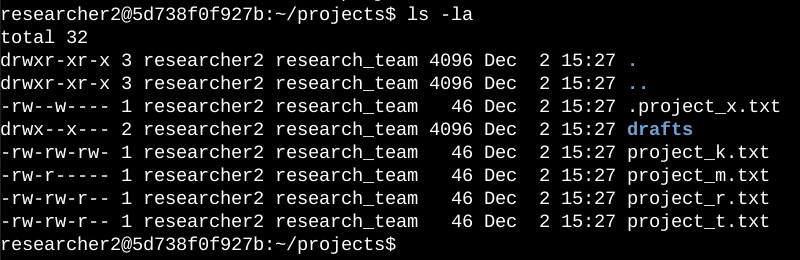
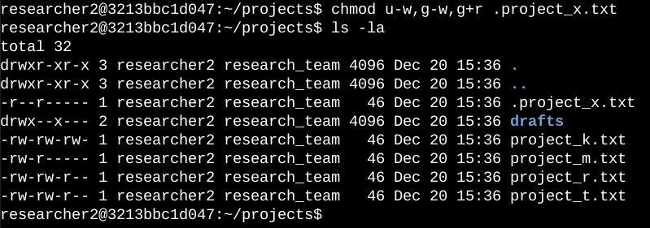
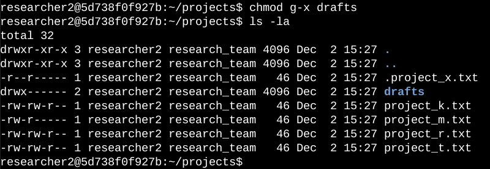

# Linux File Permissions – Security Project

##  Project Overview
This project demonstrates how I managed file and directory permissions in Linux to improve system security.

The objective was to ensure that users only had the access level required for their role, following the principle of least privilege.

I used common Linux command-line tools to inspect, understand, and modify permissions inside a projects directory.


## Checking Existing Permissions
I started by reviewing the current permissions of files and directories using:

```bash
   ls -la
```
This command displays:
hidden files
file ownership
detailed permission settings
From the output, I identified:
regular files
a hidden file
a subdirectory named drafts
Each file showed a 10-character permission string that defines access rights.


## Understanding Linux Permission Strings
Linux permissions are represented by a 10-character string:
1st character → file type
d = directory
- = regular file
Characters 2–4 → user permissions (read, write, execute)
Characters 5–7 → group permissions
Characters 8–10 → other permissions
Example:
 ## -rw-rw-r--
Meaning:
user and group can read and write
others can only read
no execute permission for anyone


## Updating File Permissions
The organization required that other users must not have write access.
To fix this, I removed write permissions for others on specific files using:
```Bash
  chmod o-w project_k.txt
```
I verified the changes with:

```Bash
  ls -la
```
  


## Securing a Hidden File
The hidden file .project_x.txt was archived and required stricter access rules:
user → read only
group → read only
no write permissions allowed
I updated the permissions using:
```Bash
  chmod u-w,g-w,g+r .project_x.txt
```
  

## Restricting Directory Access
Only the user researcher2 was allowed to access the drafts directory.
This meant removing execute permissions from the group and other users:
```Bash
  ## chmod g-x drafts
```
The correct user already had the required permissions.



  ## Final Result
At the end of this project, I successfully:
- analyzed Linux file and directory permissions
- modified permissions using chmod
- secured sensitive and archived files
- restricted directory access to specific users
- This project demonstrates practical experience with:
- Linux command-line tools
- file system security
access control fundamentals
